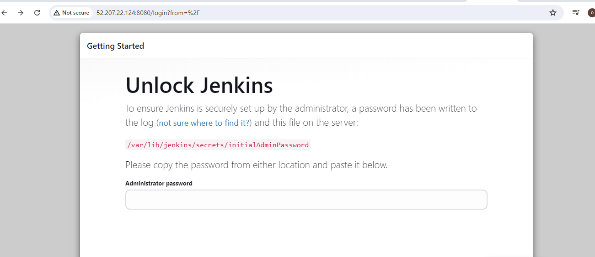

# Ansible--Automation
Purpose of this project is to Automate the configuration of 2 Webservers, 1 DB Server, 1 NFS server and 1 LB server using Ansible and Jenkins

Configure ansible Client as a Jump Server (Bastion Host). A Jump Server (sometimes also referred as Bastion Host) is an intermediary server through which access to internal network can be provided. That means, even DevOps engineers cannot SSH into the Web servers directly and can only access it through a Jump Server - it provides better security and reduces attack surface.

First, launch Ec2 instance and make sure they all have same key pem and inbound rule

Pick individual subnets and configure ports

Install and configure Ansible on your Ec2 instance

`sudo apt update`

`sudo apt install ansible`

`sudo apt update && sudo apt install -y fontconfig openjdk-17-jre`

`echo "deb [signed-by=/usr/share/keyrings/jenkins-keyring.asc] https://pkg.jenkins.io/debian binary/" | sudo tee /etc/apt/sources.list.d/jenkins.list > /dev/null`

`sudo wget -O /usr/share/keyrings/jenkins-keyring.asc https://pkg.jenkins.io/debian/jenkins.io-2023.key`

`sudo apt update && sudo apt install -y Jenkins`

`sudo systemctl status Jenkins`

`cat /var/lib/jenkins/secrets/initialAdminPassword` 
to get the admit password to jenkins

On vscode, install remote development. This helps to schieve remote connection

For Linux users – ssh-agent on linux

eval `ssh-agent -s`
ssh-add <path-to-private-key>
   
Confirm the key has been added with the command below, you should see the name of your key

ssh-add -l

Now, ssh into your Jenkins-Ansible server using ssh-agent

ssh -A ubuntu@public-ip

Also notice, that your Load Balancer user is ubuntu and user for RHEL-based servers is ec2-user.

Configure a webhook in GitHub and set the webhook to trigger ansible build

configure Jenkins build job to archive the repository content everytime change is made
Configure a webhook in GitHub and set the webhook to trigger ansible build.
Create a new Freestyle project ansible in Jenkins and point it to your 'ansible-config-mgt' repository. 
Configure a Post-build job to save all (**) files, like you did it in Project 9.

Download crumb

configure the freestyle project to link up with git

Test the setup by making some change in README.md file in main branch and make sure that builds starts automatically and Jenkins saves the files (build artifacts) in following folder

In the ansible-config-mgt GitHub repository, create a new branch,  prj11, that will be used for development of a new feature.
Checkout the newly created feature branch to your local machine and start building your code and directory structure

Create a directory and name it playbooks - it will be used to store all playbook files.

Create a directory and name it inventory - it will be used to keep  hosts organised.
Within the playbooks folder, create your first playbook, and name it common.yml

Within the inventory folder, create an inventory file () for each environment (Development, Staging Testing and Production) dev.yml, staging.yml, uat.yml, and prod.yml respectively.
configure host

Set up the Ansible Inventory
Ansible inventory file defines the hosts and groups of hosts upon which commands, modules, and tasks in a playbook operate. 
update the inventory with the IP address of the servers

[nfs]
<NFS-Server-Private-IP-Address> ansible_ssh_user=ec2-user

[webservers]
<Web-Server1-Private-IP-Address> ansible_ssh_user=ec2-user
<Web-Server2-Private-IP-Address> ansible_ssh_user=ec2-user

[db]
<Database-Private-IP-Address> ansible_ssh_user=ec2-user 

[lb]
<Load-Balancer-Private-IP-Address> ansible_ssh_user=Ubuntu

Create a playbook on common.yml
---
- name: update web, nfs and db servers
  hosts: webservers, nfs, db
  become: yes
  tasks:
    - name: ensure wireshark is at the latest version
      yum:
        name: wireshark
        state: latest
   

- name: update LB server
  hosts: lb
  become: yes
  tasks:
    - name: Update apt repo
      apt: 
        update_cache: yes

    - name: ensure wireshark is at the latest version
      apt:
        name: wireshark
        state: latest

update git with the recent code

Create a Pull request (PR)
Wear the hat of another developer for a second, and act as a reviewer.

Once your code changes appear in main branch - Jenkins will do its job and save all the files (build artifacts) to

/var/lib/jenkins/jobs/ansible/builds/<build_number>/archive/ directory on Jenkins-Ansible server. 

check out of the new branch to main andn creat a pull request

Run the ansible playbook

`ansible-playbook -i inventory/dev.yml playbooks/common.yml`

then go to each of the servers to confirm wireshark installation by checking for wireshark version

confirm wireshark is installed in the servers

